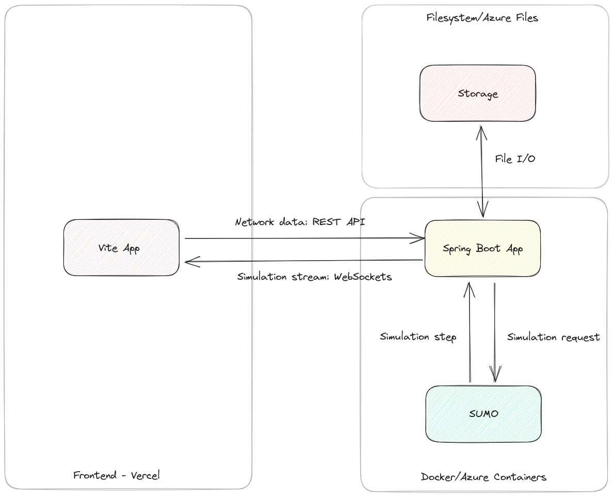
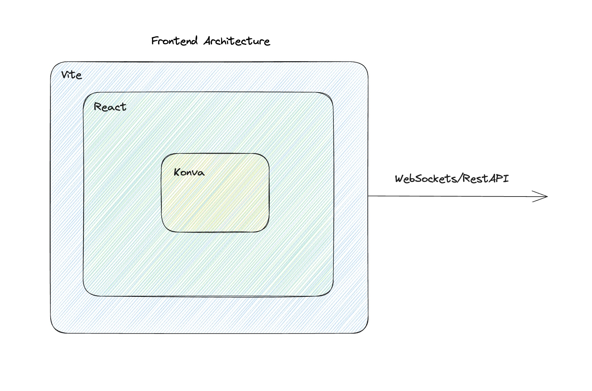

# Architecture

`urbanflo-vite` acts as the frontend to UrbanFlo, and is responsible for displaying the road network and simulation in a canvas. Simulation results are streamed from the backend via WebSocket, while other backend communication is done via REST API.

The frontend UI is done using [React](https://react.dev/) while [Konva](https://konvajs.org/index.html) is used for the canvas component itself. We use [Vite](https://vitejs.dev/) for tooling and development server.

