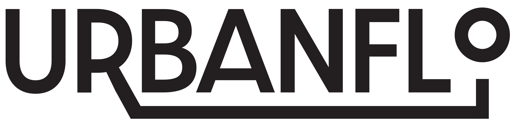
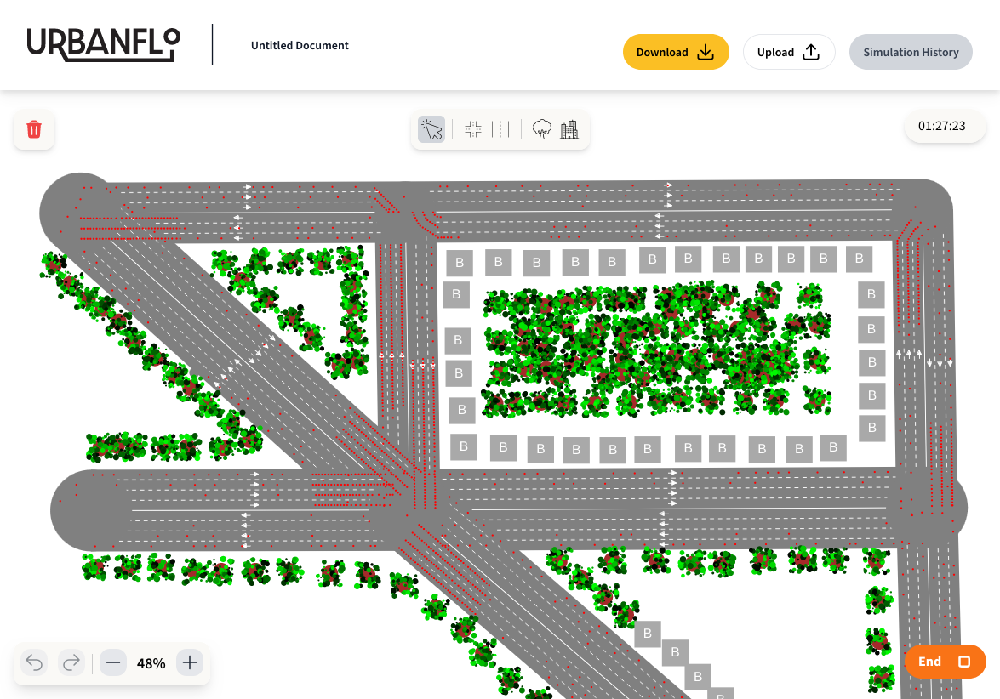
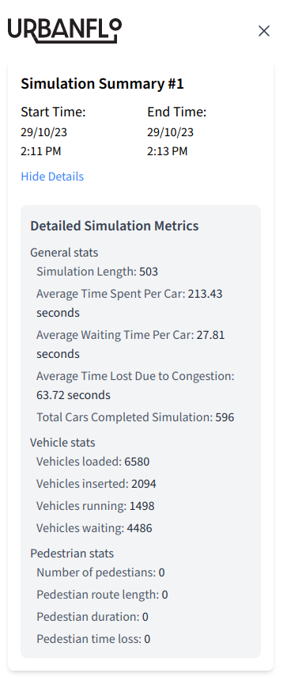

# Urban Flo




Urban Flo allows users to model traffic networks, run simulations and
collect information on the networks efficiency.

## Features

- Backed by [SUMO](https://sumo.dlr.de) for simulation engine
- 100% web based - no need for complicated installation
- Simulation statistics
- Save and load your network to your device at any time
- Free and open source (MIT licensed)

## Screenshots

Simulation UI:



Simulation statistics:



## Development

To start development on Urban Flo

### Install Dependencies

```bash
pnpm install
```

### To run the application

```bash
pnpm dev
```

### Connecting to the SUMO server

A developer has two options, either to connect and run simulations on the cloud server running on `sumo-server.urbanflo.app` or run the server locally.

To run the server locally, follow the instructions in the [server's repository](https://github.com/igloo-4002/urbanflo-sumo-server)

## Contributors

<a href = "https://github.com/igloo-4002/urbanflo-vite/graphs/contributors">
  
</a>

## Licence

Licensed under [MIT License](LICENSE.txt).