# UrbanFlo User Guide

## Creating your first network

1. Click on the intersection button to allow placing intersections.
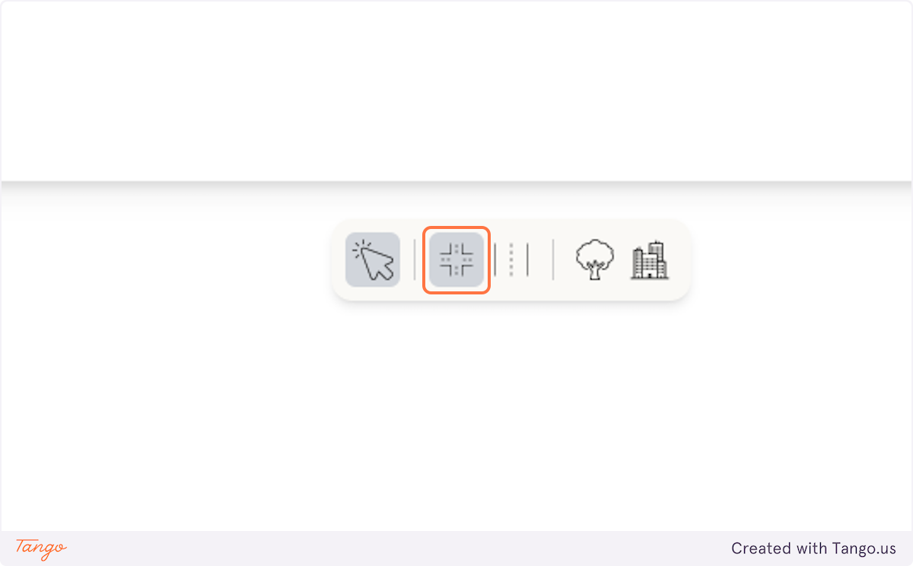

2. Click anywhere in the canvas to place an intersection or end of the road (which we'll call a node). Here we have two nodes.
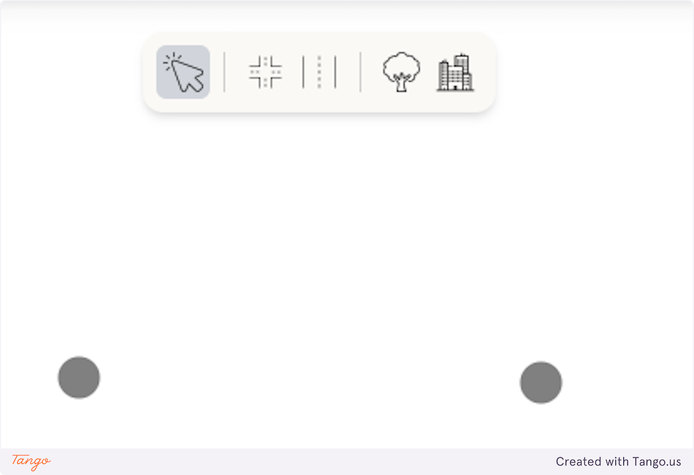

3. We can now connect the nodes together to create a road by clicking the left node and then the right node/
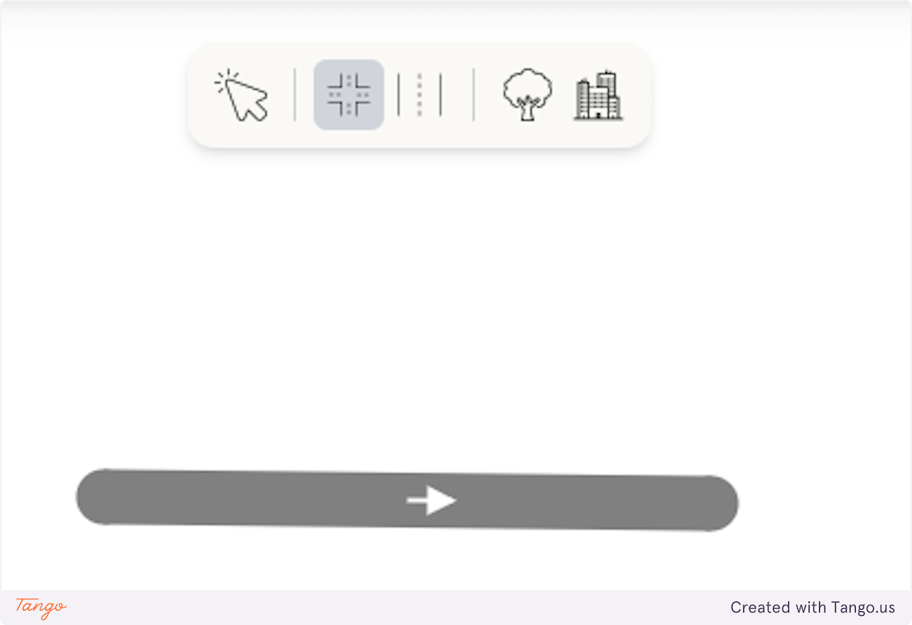

4. Notice the arrow, we've just created a one way road. To create a two way road, click on the right node and then the left node.
In general the process of creating a connection is to click the origin node and then the destination node.
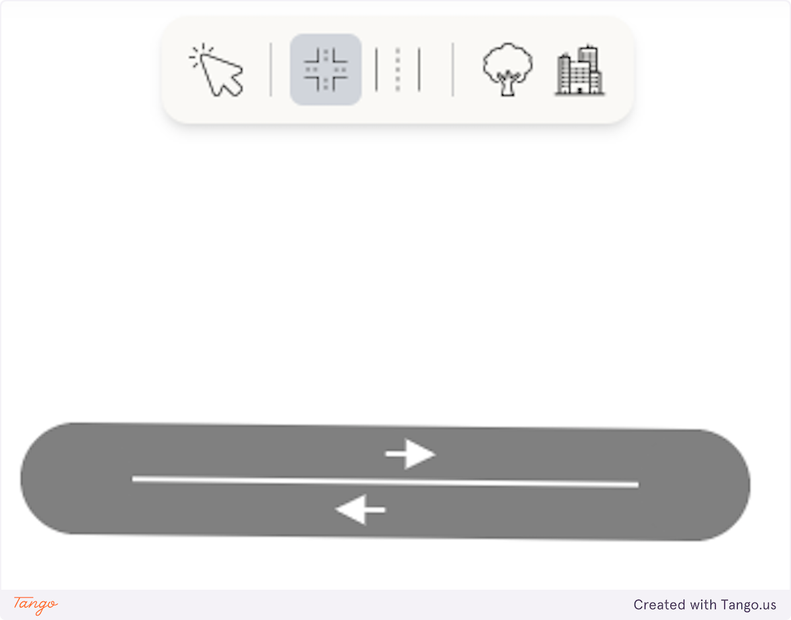

5. Let's add more nodes and connections to create a simple T intersection
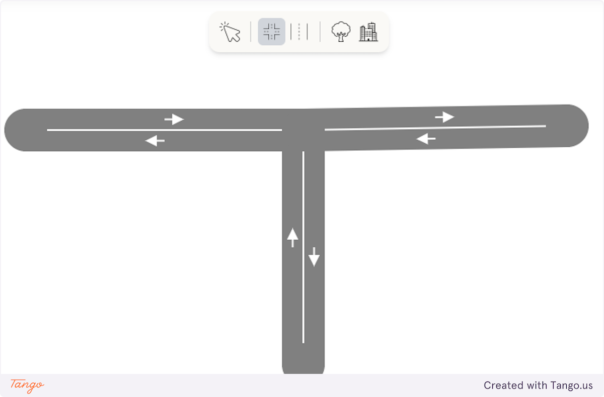

6. Once you're happy with the network, click on 'Start' on the bottom right corner, and watch as cars fill by the intersection!
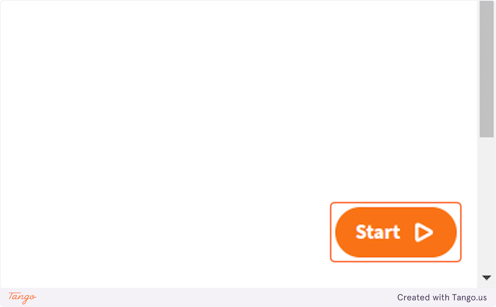

7. To stop the simulation, press the 'End' button on the bottom right corner.
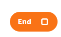

8. You can run as many simulations as you want for each network, and each simulation's statistics is recorded which can be access by clicking 'Simulation History' on the top right corner.
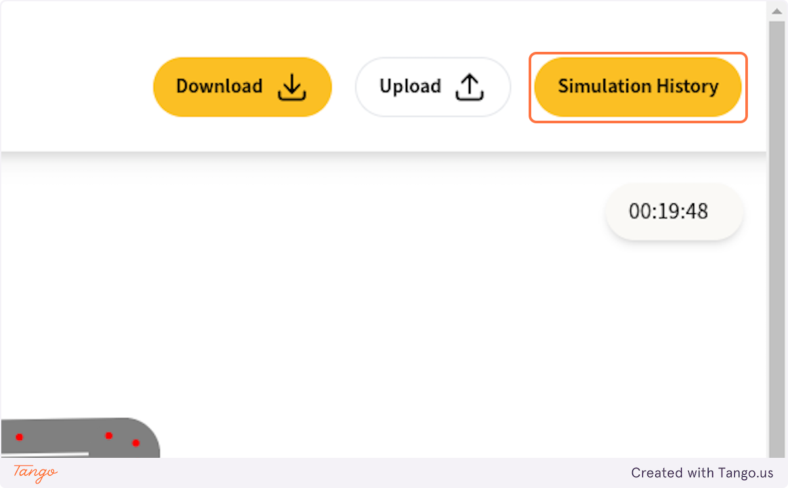

9. The simulation history screen shows the start and end time of each simulation. To view detailed simulation statistics, click on 'Show Details'.
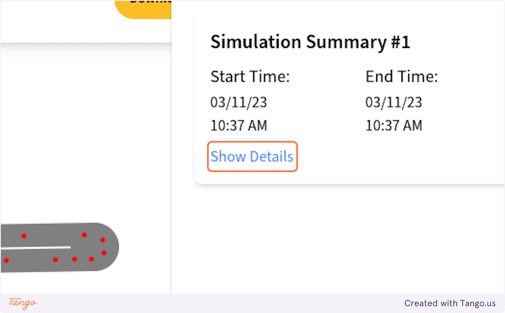

A detailed simulation statistics should show up like this:

## Renaming, downloading and uploading network

You can rename the network by clicking the text next to Urbanflo logo:

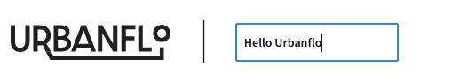

You can save the network to your computer by clicking the 'Download' button in the top right corner, which will download the network as a JSON file.

To restore the network, simply press 'Upload' instead. Note that any changes in the canvas will be overwritten.

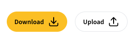

## Changing network properties

You can modify the properties of each road and intersection (e.g. road name, number of lanes) by clicking on each item.

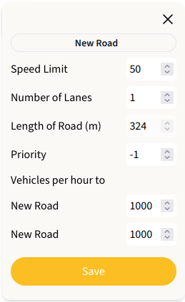

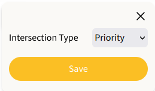

In addition, you can hover over each road/intersection to view current properties at a glance.

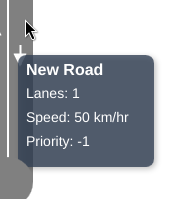